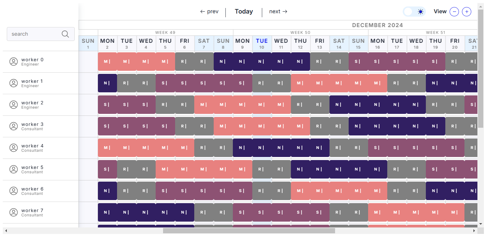

# Employee Scheduling (Java, Quarkus, Maven)

Schedule shifts to employees, accounting for minimum employees per shift per day, and shiftAssignment skill requirements.

## Prerequisites

1. Install Java and Maven, for example with [Sdkman](https://sdkman.io):
   
    `$ sdk install java`

    `$ sdk install maven`
   

## Run the application

1. Git clone this repo and navigate to this directory:

    
    `$ git clone https://github.com/slihatim/employee-scheduling3.git`
   
    `$ cd employee-scheduling3/toRun`
   

2. Start the application with Maven:

   `$ mvn quarkus:dev`
   

3. Visit [http://localhost:8080](http://localhost:8080) in your browser.

## Input Data

1. With a command Line, navigate to the directory where you have input data, in my case :

    `$ cd desktop/stage-alten/employee-scheduling3`

2. To run the solver, make a POST request with the data as follows:

    `$ curl -X POST -H "Content-Type: application/json" -d @Version2Sample2.json http://localhost:8080/schedules`

    The response will be an id.

3. If you want to Terminate the solving Early, use that id with this command :

    `$ curl -X DELETE -H 'Accept:application/json' http://localhost:8080/schedules/{id}`

## Output Data

1. The output will be in [http://localhost:8080/schedules/{id}](http://localhost:8080/schedules/{id})

## Visualising the solution

- To visualize the solution, use the html file : `Visualizing-data2.html` in the root directory.

- Replace the `date` string in the script of this html file by the JSON solution you get.